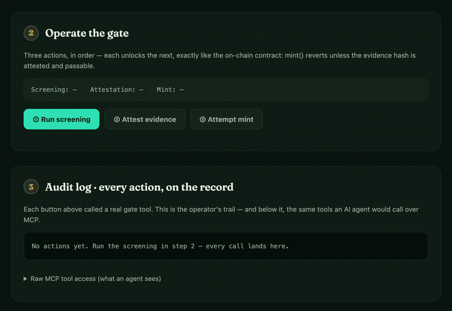

<div align="center">


# HatchFi · 链孵

### Where compliant RWAs hatch into Agent Skills.

Issue a compliant RWA on Pharos with an AI agent — and keep a private operating Skill for that asset that improves as you use it.

Now includes a **reusable primitive**: `HatchFi Diligence Gate` (`lib/hatchfi-gate`) with MCP/LangChain/Vercel adapters, a web demo (`web/`), and one-command readiness checks (`npm run judge:readiness`).

[](./docs/COMPLETED_VALIDATION.md)
[](./eval/skill_behavior_cases.json)
[](https://atlantic.pharosscan.xyz/address/0x975704ca2182b3fc64fd82ad2c01d8ec5be0b5c3)
[](https://atlantic.pharosscan.xyz/address/0x4FD317Ec868fdbd6e95c56f157DDf86d7b97F400)
[](./skills/MPF-asset/SKILL.md)
[](./docs/SKILL_SECURITY_REPORT.md)
[](./src/CompliantRWAToken.sol)

**English**  ·  [中文](./README.zh.md)  ·  [Pitch Deck](./docs/deck/index.html)  ·  [Live Dashboard](https://htmlpreview.github.io/?https://github.com/rachelzzz1921/hatchfi-pharos-skill/blob/main/SUBMISSION_DASHBOARD.html)

Built for the [Pharos Skill Engine](https://docs.pharos.xyz/tooling-and-infrastructure/pharos-skill-engine-guide) · works on Pharos Atlantic Testnet



<sub>The compliance operator console: OFAC counterparty → RED → mint denied · clean issuer → GREEN → mint allowed. <a href="./docs/deck/index.html">Deck</a> · <a href="https://atlantic.pharosscan.xyz/address/0x975704ca2182b3fc64fd82ad2c01d8ec5be0b5c3">Live on Atlantic</a></sub>

</div>

---

## What is HatchFi

HatchFi is an **agent-native issuance layer** for compliant RealFi on Pharos. It packages the full lifecycle of a regulated real-world asset — pre-issuance diligence, ERC-3643-style compliant issuance, lifecycle ops, yield distribution, on-chain audit — into a Pharos **Skill** that an AI agent can run end-to-end.

When an asset is issued, HatchFi also **spawns a private operating Skill for that exact asset** (contract address and commands baked in). You then operate the asset in natural language, and that Skill keeps a private preference profile that you can refine over time.

```
①  Diligence Gate   →   ②  Compliant Issuance   →   ③  Skill Hatch (yours)
   3-stage evidence        ERC-3643 token, deployed     spawn skills/<SYMBOL>-asset/
   sanctions+onchain+      on Pharos Atlantic           private-by-default · serves you
   offchain → GREEN/       identity·compliance·freeze   5 diligence refs · refine
   YELLOW/RED · optional on-chain evidence_hash attest
```

## Research context

Agent-orchestrated RWA tokenization is an active research direction ([Borjigin et al., 2025 — arXiv:2507.00096](https://arxiv.org/abs/2507.00096)). That paper proposes multi-agent workflows with an **AI governance** layer; HatchFi is a **deterministic, deployed** counterpart:

- **Adopts**: staged agent playbooks, approval-before-mint, on-chain diligence hash attestation (`onchain-attestation.md`), duplicate-tokenization registry (#19).
- **Does not adopt**: AI governance decisions, authoritative valuation agents, stake-slashing economics — replaced by reproducible RED/YELLOW/GREEN gates and `evidence{}` audit trails.

Full mapping: [`docs/PAPER_ALIGNMENT.md`](./docs/PAPER_ALIGNMENT.md).

It extends the official [Pharos Skill Engine](https://docs.pharos.xyz/tooling-and-infrastructure/pharos-skill-engine-guide) — keeping `assets/networks.json`, write pre-checks, and `pharos-base-ops.md`, and adding RWA-specific playbooks, a spawn/refine pipeline, a contract-surface generator, an eval harness, and a static security gate on top.

> Extends the official [Pharos Skill Engine](https://docs.pharos.xyz/tooling-and-infrastructure/pharos-skill-engine-guide). Submission overview and verification evidence: [Live Dashboard](./SUBMISSION_DASHBOARD.html) · [`docs/SUBMISSION.md`](./docs/SUBMISSION.md).

## Project progress

| Milestone | Status | Evidence |
|---|---|---|
| Core contract + Atlantic deploy | Done | MPF @ [`0x9757…b5C3`](https://atlantic.pharosscan.xyz/address/0x975704ca2182b3fc64fd82ad2c01d8ec5be0b5c3) · smoke mint receipt `status==1` |
| Three-stage diligence pipeline | Done | 4 playbooks · [`docs/diligence/INTEGRATION.md`](./docs/diligence/INTEGRATION.md) |
| OFAC denylist sync | Done | 93 ETH addresses · `npm run diligence:sync` · snapshot 2026-06-18 |
| Mock OFAC oracle (Atlantic) | Done | [`0x4FD3…F400`](https://atlantic.pharosscan.xyz/address/0x4FD317Ec868fdbd6e95c56f157DDf86d7b97F400) · demo RED @ `0x7F36…be1B` |
| Skill eval harness | Done | **64/64** · `npm run eval:skill` (Python + Foundry golden parity) |
| MPF asset Skill spawn | Done | [`skills/MPF-asset/`](./skills/MPF-asset/SKILL.md) v8 · 6 diligence refs per child |
| Paper-driven Round 8–10 | Done | `#19`/`#20` · attestation · monitoring · dry-run · [`PAPER_ALIGNMENT.md`](./docs/PAPER_ALIGNMENT.md) |
| Diligence Gate primitive + adapters | Done | [`lib/hatchfi-gate/`](./lib/hatchfi-gate/SKILL.md) · `diligence_screen`/`diligence_rate`/`diligence_gate_mint`/`diligence_get_attestation` |
| Visible demo + judge mode | Done | `npm run web:dev` · `npm run gate:cli` · `npm run judge:package` |
| GitHub main | Done | [`hatchfi-pharos-skill`](https://github.com/rachelzzz1921/hatchfi-pharos-skill) |

---

## Judge quick test

```bash
npm install
npm run gate:test            # deterministic gate unit checks
npm run gate:cli             # narrated RED->GREEN->attest->gate flow
npm run judge:package        # gate:test + gate:cli + mcp:probe + judge:readiness
npm run judge:readiness:strict # strict on-chain trust-model checks — 6/6 (hardened deployment live)
npm run web:dev              # compliance operator console (screen -> attest -> mint, audit-logged, EN/ZH)
```

### Judging criteria → command → evidence

| Criterion | Run this | Evidence you'll see |
|---|---|---|
| **Pharos vision fit** — RWA · protocol-native compliance · agentic | read [`SKILL.md`](./SKILL.md) pipeline | 3-stage diligence → issuance → spawn; ERC-3643 two checks; MPF live on Atlantic |
| **Technical completeness** | `npm run build && npm run test` | 45 Foundry tests (roles · two-phase recovery · attestation-gated mint · pro-rata dividends) |
| **Verifiable in minutes, no wallet** | `npm run judge:package` | `gate:test` PASS · narrated RED→GREEN · `TOOLS 8` · readiness |
| **Composability / agent integration** | `npm run mcp:probe` | 8 MCP tools (5 gate + 3 live on-chain reads) + LangChain/Vercel adapters |
| **Security posture** | `npm run inspect:skill` | 0 critical / 0 high — the Skill scans itself before publish |
| **On-chain proof** | [PharosScan](https://atlantic.pharosscan.xyz/address/0x975704ca2182b3fc64fd82ad2c01d8ec5be0b5c3) · `rwa_token_metadata` | deployed `CompliantRWAToken` + Mock OFAC oracle |
| **Determinism / auditability** | `npm run eval:skill` · `npm run evidence:hash` | 64/64 evals; evidence hash reproducible in Python **and** Solidity ([protocol](./docs/diligence-attestation-protocol.md)) |

---

## Quick start

```bash
# 1 · toolchain
curl -L https://foundry.paradigm.xyz | bash && foundryup
forge install OpenZeppelin/openzeppelin-contracts@v5.1.0 && forge install foundry-rs/forge-std

# 2 · build + verify locally (no wallet needed)
npm run build && npm run test       # 45 Foundry tests
npm run eval:skill                  # 64 deterministic skill checks
npm run inspect:skill               # static security scan
npm run check                       # full local gate (build · test · refs · eval · inspector)
```

To deploy and operate on Pharos Atlantic:

```bash
export PRIVATE_KEY=0x...                                   # local only, never committed
export PHAROS_RPC_URL=https://atlantic.dplabs-internal.com
npm run preflight:pharos            # chainId 688689 + balance pre-checks
npm run deploy:pharos               # deploy → deployments/pharos.json
npm run smoke:pharos                # mint + receipt assert (registerIdentity if needed)
npm run spawn:asset                 # → skills/<SYMBOL>-asset/  (your private operating Skill)
```

Walkthroughs: [`QUICKSTART.md`](./docs/QUICKSTART.md) · [`WORKED_EXAMPLE.md`](./docs/WORKED_EXAMPLE.md)

---

## How to use it — command reference

HatchFi is operated through `npm` scripts that wrap Foundry, `cast`, and the agent tooling. Grouped by what you're doing:

### Build & verify

| Command | What it does |
|---|---|
| `npm run build` | `forge build` |
| `npm run test` | Foundry tests (incl. recovery identity binding + attestation mint gate + dividend fuzz) |
| `npm run check` | Full local gate: build · test · key check · refs drift · eval · inspector |
| `npm run gate:test` | Deterministic diligence gate checks (TS) |
| `npm run gate:cli` | Narrated CLI flow (RED -> GREEN -> attest -> gate mint) |
| `npm run gate:demo` | CLI JSON demo: RED block + GREEN attest + mint gate pass |
| `npm run judge:package` | Judge one-command package: `gate:test + gate:cli + mcp:probe + judge:readiness` |
| `npm run judge:readiness` | Read-only Atlantic readiness checks (judge-friendly N/N output) |

### Deploy & operate on-chain

| Command | What it does |
|---|---|
| `npm run preflight:pharos` | Verify chainId `688689`, deployer balance, env before any write |
| `npm run deploy:pharos` | Deploy `CompliantRWAToken`, record `deployments/pharos.json` |
| `npm run smoke:pharos` | `mint` + receipt assert (`registerIdentity` skipped if deployer already verified; idempotent) |
| `npm run verify:pharos` | Re-read on-chain state for reconciliation |

### Spawn & evolve the asset Skill

| Command | What it does |
|---|---|
| `npm run spawn:asset` | Generate `skills/<SYMBOL>-asset/` from the deployed asset (deterministic template fill) |
| `npm run refine:asset` | Refine the Skill from `state.personalization` → writes `PREFERENCES.md` (no redeploy) |
| `npm run spawn:versions` | List archived versions under `skills/<SYMBOL>-asset/versions/` |
| `npm run spawn:rollback <id>` | Roll back the Skill to an archived version (current state archived first) |

### Generate references from the contract

| Command | What it does |
|---|---|
| `npm run refs:generate` | Parse `CompliantRWAToken.sol` → `references/generated/contract-surface.{md,json}` |
| `npm run refs:check` | Same, but fails if the manual cheat sheet drifts from the parsed contract |

### Evaluate the Skill

| Command | What it does |
|---|---|
| `npm run eval:skill` | 64 deterministic checks: diligence gate, risk tiers, consent gates, spawn structure |
| `npm run eval:skill:json` | Same suite, machine-readable JSON |

### Security gate (before install / upload / publish / share)

| Command | What it does |
|---|---|
| `npm run inspect:skill` | Static-only scan — prompt injection, secrets, dangerous patterns, Web3/Solidity risks |
| `npm run inspect:skill:md` / `:json` | Write report to `docs/SKILL_SECURITY_REPORT.{md,json}` |
| `npm run publish:check` | Inspector + full `check.sh` — run this before sharing |

### Reusable primitive + adapters

| Command | What it does |
|---|---|
| `npm run mcp` | Start MCP stdio server for HatchFi Diligence Gate |
| `npm run web:dev` | Start interactive React demo |
| `npm run web:build` | Build static web demo bundle |

### Diligence (sanctions + background + on-chain)

| Command | What it does |
|---|---|
| `npm run diligence:sync` | Refresh OFAC ETH JSON + merge into local `state.json` |
| `npm run deploy:mock-ofac` | Deploy `MockOFACRegistry` on Atlantic (needs `PRIVATE_KEY`) |
| `npm run sync:zh-diligence` | Regenerate zh locale diligence reference mirrors |

---

## The pipeline an agent runs

```
Phase A  Diligence Gate     →  Phase B  Compliant Issuance  →  Phase C  Lifecycle Ops     →  Phase D  Skill Hatch        →  Phase E  Security Gate
         3-stage evidence          deploy ERC-3643 token            whitelist / freeze / mint     spawn skills/MPF-asset/     static-only inspector
         sanctions+onchain+        identity·compliance·freeze       dividends / recovery / audit  4 diligence refs · private  prompt/secret/Web3/Solidity
         offchain → GREEN/         45 tests + audit trail           cast logs (18 events)         refine · version · rollback block critical/high
         YELLOW/RED · RED blocks
```

**10 agent playbooks** in `references/`: `onchain-diligence` · `offchain-diligence` · `sanctions-screening` · `compliance-knowledge` · `rwa-issuance` · `rwa-dividend` · `spawn-asset-skill` · `pharos-base-ops` · `pharos-deploy-runbook` · `pharos-verification`

**Auto-generated contract surface** (`npm run refs:generate`): 44 callable entries (external/public functions + public getters) · 18 ERC-3643-aligned events · 14 typed errors · 45 Foundry tests including a fuzz invariant.

---

## Compliance is the base, not an afterthought

The contract is **ERC-3643-style** (T-REX). Every transfer is forced through a triple gate in the `_update()` hook:

```
transfer / mint / forcedTransfer
        │
        ▼  _update() hook
   ┌──────────────┬──────────────────────┬─────────────────────┐
   │ Identity     │ Compliance           │ Freeze              │
   │ isVerified() │ canTransfer()        │ unfrozen ≥ amount   │
   │ KYC holder   │ holder/balance caps  │ wallet not frozen   │
   └──────────────┴──────────────────────┴─────────────────────┘
        │ all pass → transfer + auto dividend settle
        │ any fail → revert (NotVerified / ComplianceFailure / WalletFrozen)
```

- **transfer** → all three gates
- **mint** → identity **and** compliance caps (primary issuance respects holder/balance limits)
- **forcedTransfer** → regulatory path; verified recipient only, bypasses global rules

### Pre-issuance diligence gate (Phase A)

Before any deploy/mint, the agent runs a **three-stage diligence pipeline** (background → check selection → sanctions + on-chain + off-chain evidence). Each conclusion is evidence-backed — command, raw result, inference, flag — written to `state.diligence`. **A RED rating blocks all issuance.**

| Layer | Checks (summary) | RED trigger |
|---|---|---|
| Sanctions (#1/#11) | `state.config.denylist` · optional Mock Oracle · snapshot staleness → warn | denylist / oracle hit → **risk → RED** |
| On-chain (#2–#10) | `cast code` · `codesize` · `balance` · `nonce` · logs/history · proxy slot | self-destruct · denylist counterparty · stacked centralization |
| Off-chain (#12–#15) | issuer/custodian questionnaire · KYC expiry · jurisdiction | fake license · no legal wrapper · expired KYC |

Sync OFAC snapshot: `npm run diligence:sync` · Full playbooks: [`references/onchain-diligence.md`](./references/onchain-diligence.md) · [`offchain-diligence.md`](./references/offchain-diligence.md) · [`sanctions-screening.md`](./references/sanctions-screening.md)

### Four modules in one contract (future-split ready)

Function and event names follow **ERC-3643 (T-REX)** so the contract can be split into a standard multi-contract suite later:

- **IdentityRegistry** — `isVerified` / `registerIdentity` / `removeIdentity`
- **ModularCompliance** — `canTransfer` / `maxHolders` / `maxBalancePerInvestor`
- **Lifecycle** — freeze / `forcedTransfer` / two-phase `executeRecoveryAddress` / pause
- **Dividends** — `depositDividend` / `claimDividend` / `sweepUndistributedDividend`

**Permission matrix**: `onlyOwner` (governance, dividends, dust sweep) vs `onlyAgent` (KYC, mint, freeze, regulatory paths) — full table in [`docs/SECURITY.md`](./docs/SECURITY.md).

---

## The Skill that grows with you

Most issuance tools produce one deployed token and stop. HatchFi produces a deployed token **plus a private operating Skill** for that exact asset — contract address and command set baked in. As you operate the asset in natural language, the Skill keeps a private preference profile (jurisdictions, holder caps, dividend cadence, disclosure templates) that you can refine over time.

```
HatchFi (parent skill)
  └── issues MPF on Atlantic  ──spawn──►  skills/MPF-asset/   ◄── serves you first
        └── you keep operating it ──refine──►  better-fit Skill   (whitelist, mint, dividends)
                                                                   WITHOUT redeploying
```

The spawn pipeline is deterministic and versioned (inspired by version-managed skill tooling):

- **`spawn:asset`** fills templates from `state.asset` — no LLM guessing — and archives any prior version.
- **`refine:asset`** writes a private `PREFERENCES.md` overlay from `state.personalization`, bumping a version counter in `meta.json` with an `evolution[]` audit trail.
- **`spawn:versions` / `spawn:rollback`** list and restore archived snapshots under `versions/`.

Each spawned Skill also carries an auto-generated `<SYMBOL>-contract-surface.md`, kept in sync with the on-chain contract via `refs:generate`.

### You own the data. Sharing is your call.

Everything the Skill accumulates — investor identities, diligence evidence, dividend detail, your preferences — is **yours and private by default**. It lives in your local `state.json` (gitignored), never on-chain, never bundled into a shareable package.

- **Deposit consent** — before any personal/sensitive info is recorded, the agent asks.
- **Share consent** — opening a Skill or any data scope to others is an explicit opt-in that emits a **permission manifest** (exactly what's *exposed* vs *withheld*). See [`PERMISSIONS.md`](./skills/MPF-asset/PERMISSIONS.md).

> **Sharing a Skill ≠ sharing your data.** A spawned Skill carries only the public operating surface (contract address + commands); your sovereign ledger (`state.json`, including `PREFERENCES.md`) stays on your machine unless you choose otherwise.

Issuing **MPF** produced [`skills/MPF-asset/`](./skills/MPF-asset/SKILL.md) — a private operating Skill with a permission manifest. If an issuer later chooses to share it, the package includes only the public surface (contract address, commands, references) — not owner data.

---

## Built to be operated by an agent

HatchFi is a Pharos **Skill**, not a script. The agent follows [`SKILL.md`](./SKILL.md) with operational discipline:

- **Diligence-first** — a RED rating or failed checks block issuance, with evidence
- **Risk tiers** — Low: auto · Medium: audit trail · High: human confirm before deploy/mint/dividend
- **Consent gates** — explicit consent before depositing personal data or sharing a Skill (with a permission manifest)
- **Skill Inspector gate** — static scan before install/upload/publish/share; critical/high findings block release
- **Receipt assertions** — every write verifies `status==1` before continuing
- **Audit memory** — `state.json` records diligence, onboarding, dividends, and history — owner-private by default
- **Key safety** — private key via env only, never committed

---

## Validation

Before release, HatchFi went through a layered review loop. Issues found were fixed *with a named regression test* or explicitly documented.

| Review gate | Outcome |
|---|---|
| **TDD test suite** | 45 Foundry tests, 0 failed, including a fuzz invariant proving dividends can't over-distribute (`claimable + dust ≤ deposit`) |
| **Skill eval suite** | `npm run eval:skill` — 64/64 deterministic checks on gates, risk tiers, consent, and spawn structure |
| **Security review** ([`docs/SECURITY.md`](./docs/SECURITY.md)) | Findings documented; fixes pinned by named regression tests |
| **Compliance review** | Found and closed a compliance-critical gap (`mint` bypassing holder/balance caps) — issuance now enforces the same `canTransfer` rules as transfers |
| **Production-readiness review** | Documented in project review notes (see validation docs) |
| **Pharos Skill Inspector** | [`22/100 MEDIUM`](./docs/SKILL_SECURITY_REPORT.md) — 0 critical / 0 high / 0 medium blockers |
| **On-chain verification** | `preflight → deploy → smoke` on Atlantic **Testnet**, every executed receipt asserted `status == 1` |

Selected fixes (all test-covered):

- **D2 · compliance-critical** — `mint` now enforces `maxHolders` + `maxBalancePerInvestor`, so primary issuance can't breach the compliance envelope.
- **F1 · burn underflow** — `burn` rebalances `_frozenTokens` so a partially-frozen holder can't get locked out.
- **D3 / D4 · dividend integrity** — integer-division dust is recoverable via `sweepUndistributedDividend`; wallet recovery migrates unclaimed dividends.

---

## Verify on-chain

HatchFi is deployed and smoke-tested on **Pharos Atlantic Testnet**.

| | |
|---|---|
| **Contract (MPF)** | [`0x975704ca2182b3fc64fd82ad2c01d8ec5be0b5c3`](https://atlantic.pharosscan.xyz/address/0x975704ca2182b3fc64fd82ad2c01d8ec5be0b5c3) |
| **Deploy tx** | [`0xd00bcc…a023`](https://atlantic.pharosscan.xyz/tx/0xd00bcc18e78f85eaa9f62ee907a6adac13c9a45f6f7266699e57487beb61a023) |
| **Smoke mint tx** | [`0x1b2127…b5541`](https://atlantic.pharosscan.xyz/tx/0x1b212771313c0ad0b382f99c69c027bdd5265e0cc64b619792adbd9038063905) |
| **Mock OFAC oracle** | [`0x4FD3…F400`](https://atlantic.pharosscan.xyz/address/0x4FD317Ec868fdbd6e95c56f157DDf86d7b97F400) · deploy [`0x7ae012…a8fa`](https://atlantic.pharosscan.xyz/tx/0x7ae012f2ac8d388faa808005145054e9db338157a20be2c6f091eba5fa3fa8fa) |
| **Network** | Pharos Atlantic Testnet · chainId `688689` |
| **Spawned Skill** | [`skills/MPF-asset/SKILL.md`](./skills/MPF-asset/SKILL.md) — child skill v8 · `TOKEN=0x9757…` · 6 diligence refs |

Smoke path: `registerIdentity` is skipped when the deployer is already verified; **mint + receipt assert** is the executed write path recorded below.

Anyone can verify independently in ~2 minutes: `git clone` → `npm run build && npm run test` (45 passed) → `npm run eval:skill` (64/64) → open the contract on PharosScan (Atlantic Testnet).

---

## What's included

- ERC-3643-style RWA contract deployed on Pharos Atlantic, with a **three-stage diligence pipeline** (sanctions + on-chain + off-chain) that can block issuance
- A full agent Skill (`SKILL.md` + **10 references**) that extends the official Pharos Skill Engine
- A deterministic spawn → refine → version pipeline that leaves the issuer a private, evolving operating Skill
- An auto-generated contract-surface reference kept in sync with the Solidity source
- A 64-check eval harness and a static Skill Inspector security gate
- 45 Foundry tests, a security review with all findings addressed, and data sovereignty with opt-in sharing

---

## Documentation

| Doc | What's inside |
|---|---|
| [`SKILL.md`](./SKILL.md) | Agent entry — capability index, pre-checks, risk tiers |
| [`docs/ARCHITECTURE.md`](./docs/ARCHITECTURE.md) | System diagram, trust boundaries, and verification gates |
| [Live Dashboard](https://htmlpreview.github.io/?https://github.com/rachelzzz1921/hatchfi-pharos-skill/blob/main/SUBMISSION_DASHBOARD.html) | Submission overview & verification evidence (EN/中文) |
| [`docs/SUBMISSION.md`](./docs/SUBMISSION.md) | Submission overview and narrative |
| [`references/spawn-asset-skill.md`](./references/spawn-asset-skill.md) | Spawn / refine / version / auto-refs / eval playbook |
| [`eval/skill_behavior_cases.json`](./eval/skill_behavior_cases.json) | Eval case definitions |
| [`docs/COMPLETED_VALIDATION.md`](./docs/COMPLETED_VALIDATION.md) | Local + on-chain validation evidence |
| [`DEPLOYMENT_RESULT.md`](./DEPLOYMENT_RESULT.md) | Deploy + smoke record (generated) |
| [`docs/SECURITY.md`](./docs/SECURITY.md) | Audit findings & fixes |
| [`docs/SKILL_SECURITY_REPORT.md`](./docs/SKILL_SECURITY_REPORT.md) | Pre-publish Pharos Skill Inspector report |
| [`docs/PHAROS_VISION.md`](./docs/PHAROS_VISION.md) | RealFi / Agentic vision alignment |
| [`docs/BRAND.md`](./docs/BRAND.md) | HatchFi brand kit |

## Repository layout

```
SKILL.md                       Agent entry: intent → capability → risk → reference
src/CompliantRWAToken.sol      ERC-3643-style RWA token
test/CompliantRWAToken.t.sol   27 tests (incl. fuzz invariant)
script/Deploy.s.sol            Foundry deploy script
references/                    10 cast/forge playbooks (incl. 4 diligence)
docs/diligence/              integration notes · OFAC sync · diligence source archive
assets/knowledge/              OFAC denylist snapshot · red flags · sanctions samples
deployments/mock_ofac_atlantic.json  Mock OFAC oracle record (generated)
references/generated/          auto-generated contract surface (refs:generate)
eval/skill_behavior_cases.json eval harness case definitions
scripts/                       preflight / smoke / verify / spawn / refine / refs / eval / inspector
scripts/skill_inspector.py     static security gate before install / upload / publish / share
skills/MPF-asset/              spawned asset Skill (SKILL.md · PERMISSIONS.md · PREFERENCES.md · meta.json · versions/)
assets/                        brand logo + token/network registries + contract snapshot
deployments/pharos.json        on-chain deployment record (generated)
state.schema.json              cross-step agent memory + audit trail schema
docs/                          narrative & reference docs (see table above)
SUBMISSION_DASHBOARD.html      visual dashboard with EN/中文 toggle
```

---

<div align="center">

Built by **Zhiwei Chen (陈知维)**

Built for the Pharos Skill-to-Agent Hackathon 2026 on the Pharos RealFi chain.

[Pharos Skill Engine Guide](https://docs.pharos.xyz/tooling-and-infrastructure/pharos-skill-engine-guide) · [Pharos Docs](https://docs.pharos.xyz)

</div>
