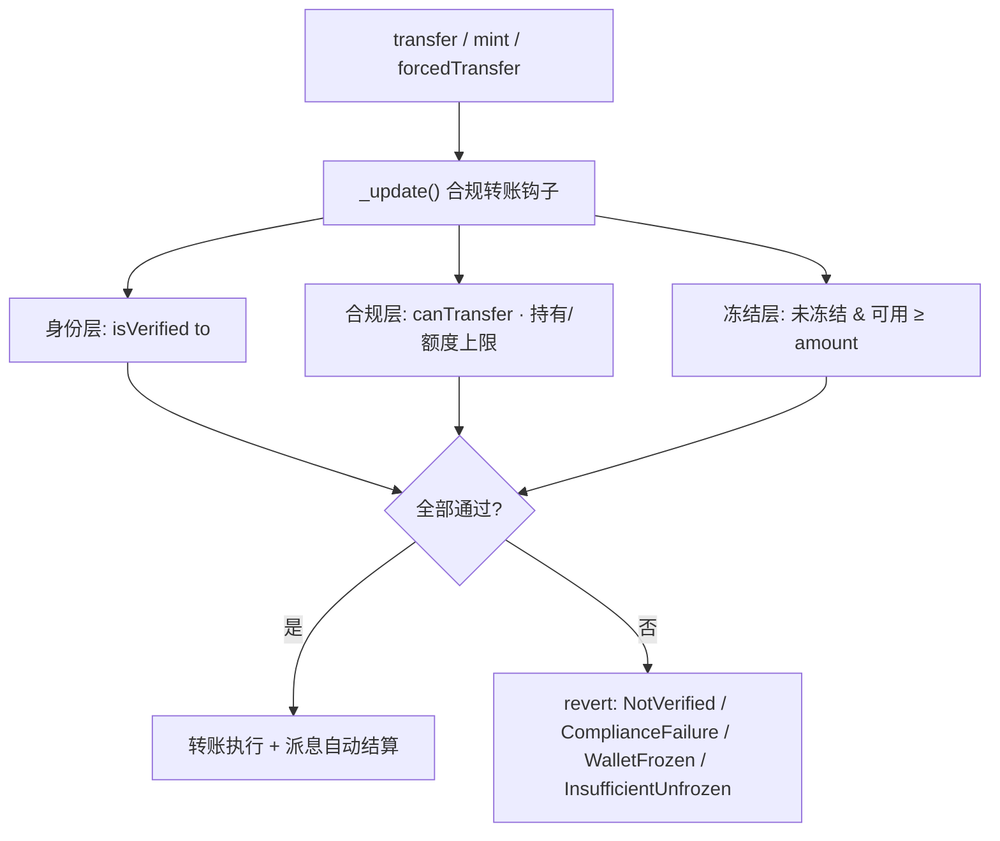

# Pharos Skill-to-Agent 提交摘要

> **项目概览（推荐先看）**
> - 浏览器：双击 `SUBMISSION_DASHBOARD.html`
> - Markdown：`SUBMISSION_DASHBOARD.md`

## 项目一句话

**Compliant RWA Issuance Agent** 是一个面向 Pharos 的合规 RWA 发行 skill，把现实世界资产上链拆成 agent 可执行、可审计、可复用的一条流水线：

```text
Onchain diligence gate -> ERC-3643 compliant issuance -> Asset-specific skill spawning
```

## 为什么适合 Pharos

Pharos 的核心叙事是 RealFi、合规价值流和 agentic infrastructure。本项目直接命中这个方向：让 agent 能先做发行前链上尽调，再部署 ERC-3643 风格的合规 RWA token，随后管理投资者准入、受限转账、冻结/恢复、收益派发，最后为已发行资产生成专属 skill，形成可复用能力单元。

## 核心亮点

- **Diligence gate**：通过只读 `cast` 命令生成 GREEN / YELLOW / RED 风险评级，每条结论都有 evidence。
- **ERC-3643-style compliance**：普通转账必须同时通过 `isVerified(to)` 和 `canTransfer(from, to, amount)` 两道检查。
- **Lifecycle management**：覆盖身份注册、转账合规预检、冻结、强制转移、钱包恢复、pause/unpause。
- **Dividend distribution**：使用累计每股派息模型，避免遍历持有人，适合 RWA 收益分配。
- **Self-spawning skill**：发行完成后可生成 `skills/<SYMBOL>-asset/`，把 token 地址和资产参数固化进资产专属 reference。
- **分阶段验证循环**：build、test、security、Pharos preflight、deploy、smoke、verify、spawn 各阶段独立 gate。

## 生态飞轮（Skill 产 Skill · 已落地）

这不是概念设计——**已在 Atlantic 测试网完整跑通**：

```text
Compliant RWA Issuance Agent（母 Skill）
  → 尽调闸门 → 部署 MPF → smoke mint
  → spawn 产出 skills/MPF-asset/（子 Skill，合约地址已写死）
  → 其他 Agent 直接 import MPF-asset，无需重新部署
```

| 层级 | 包 | 复用方式 |
|---|---|---|
| 母 Skill | `SKILL.md` + 7 份 reference | 任意 Pharos Agent 可驱动完整 RWA 发行流水线 |
| 子 Skill（已生成） | `skills/MPF-asset/` | 专管 **Manhattan Property Fund**，地址 `0xfef7…Aa3DE` 已固化 |
| 合约 | `CompliantRWAToken` @ Atlantic | 24 测试 + 链上 smoke 证明合规 mint/验证可用 |

**飞轮效应**：每发行一支新 RWA → 自动多一个可组合能力单元 → Pharos 生态 Agent 越多、可调用资产 Skill 越多 → 合规 RWA 操作边际成本趋近于零。

## Atlantic 链上证据（已验证）

| 项 | 值 |
|---|---|
| 合约 | [`0xfef7519bebda6c47af49583dbc9e60801f8aa3de`](https://atlantic.pharosscan.xyz/address/0xfef7519bebda6c47af49583dbc9e60801f8aa3de) |
| 部署 tx | [`0x71ebe5…17e4d`](https://atlantic.pharosscan.xyz/tx/0x71ebe568c6d41390cfc6b6f452c30c85d38d0b4ddead941d19383a7e39417e4d) |
| Smoke mint tx | `0x7ece3b…bb5541` · deployer `isVerified=true` · `balanceOf=1e18` · `holderCount=1` |
|  spawned 子 Skill | `skills/MPF-asset/SKILL.md`（`npm run spawn:asset` 一键生成） |

> 完整机器可读记录：`deployments/pharos.json` · `DEPLOYMENT_RESULT.md` · `COMPLETED_VALIDATION.md`

## 合约架构与合规闸门

合约把 IdentityRegistry / ModularCompliance / 生命周期 / 派息四大模块内聚进单合约，函数与事件命名严格对齐 ERC-3643，便于未来平滑拆分为标准多合约套件。每一笔转移都经由 `_update()` 钩子的三层检查：



> `mint` 与 `forcedTransfer` 为监管场景：`mint` 同样强制合规上限（持有人数/单人额度）；`forcedTransfer` 绕过合规层全局规则但仍要求收款方已验证。

## 关键文件

| 文件 | 作用 |
|---|---|
| `SKILL.md` | Agent 入口与能力索引 |
| `SUBMISSION_DASHBOARD.html` | **项目概览**（流水线 + 核心能力 + 提交包说明） |
| `references/onchain-diligence.md` | 可验证的发行前尽调闸门 |
| `references/rwa-issuance.md` | 合规发行与生命周期操作 |
| `references/rwa-dividend.md` | 收益派发 reference |
| `references/spawn-asset-skill.md` | 自我繁殖设计 |
| `references/pharos-base-ops.md` | 对齐 Pharos Skill Engine 的基础 cast/forge |
| `references/pharos-deploy-runbook.md` | Pharos 部署 runbook |
| `references/pharos-verification.md` | 分阶段质量验证循环 |
| `assets/networks.json` | Atlantic / Pacific 网络配置 |
| `src/CompliantRWAToken.sol` | ERC-3643 风格 RWA token |
| `test/CompliantRWAToken.t.sol` | 22 个 Foundry 测试用例（含 fuzz） |
| `scripts/` | preflight、部署结果、smoke、verify、spawn 自动化 |
| `VALIDATION_PLAN.md` | 可复现验证命令 |
| `skills/MPF-asset/` | **已生成的资产专属 Skill**（飞轮落点，合约地址已固化） |
| `SECURITY.md` | 合约安全审计表与权限矩阵 |
| `QUICKSTART.md` | 5 分钟上手：build → test → deploy → spawn |
| `WORKED_EXAMPLE.md` | 端到端命令流 + `state.example.json` |
| `PHAROS_VISION.md` | 与 Pharos RealFi / Agentic 愿景对齐专章 |

## 使用场景

1. 对发行方/托管方地址做 onchain diligence，展示 evidence-backed 风险评级。
2. 展示 RED 评级地址会被发行闸门拒绝。
3. 部署合规 RWA token，并注册投资者、mint 份额。
4. 展示受限转账语义：未验证地址无法接收 token。
5. 存入并查询 dividend。
6. 生成资产专属 skill，把新发行资产转化为可复用能力单元。

## 已完成验证

```bash
cd pharos-rwa-skill
npm run build && npm run test
export PRIVATE_KEY=0x...   # 仅本机终端
export PHAROS_RPC_URL=https://atlantic.dplabs-internal.com
npm run preflight:pharos && npm run deploy:pharos && npm run smoke:pharos && npm run spawn:asset
```

**本地**：Foundry 1.7.1 · `forge build` 成功 · **24 tests 全绿**（含 fuzz 不变量）· preflight OK。

**链上**：MPF 已部署 Atlantic · smoke mint 1e18 成功 · `skills/MPF-asset/` 已 spawn。

详见 `COMPLETED_VALIDATION.md`。私钥只从环境变量读取，不写入源码/文档/git。
