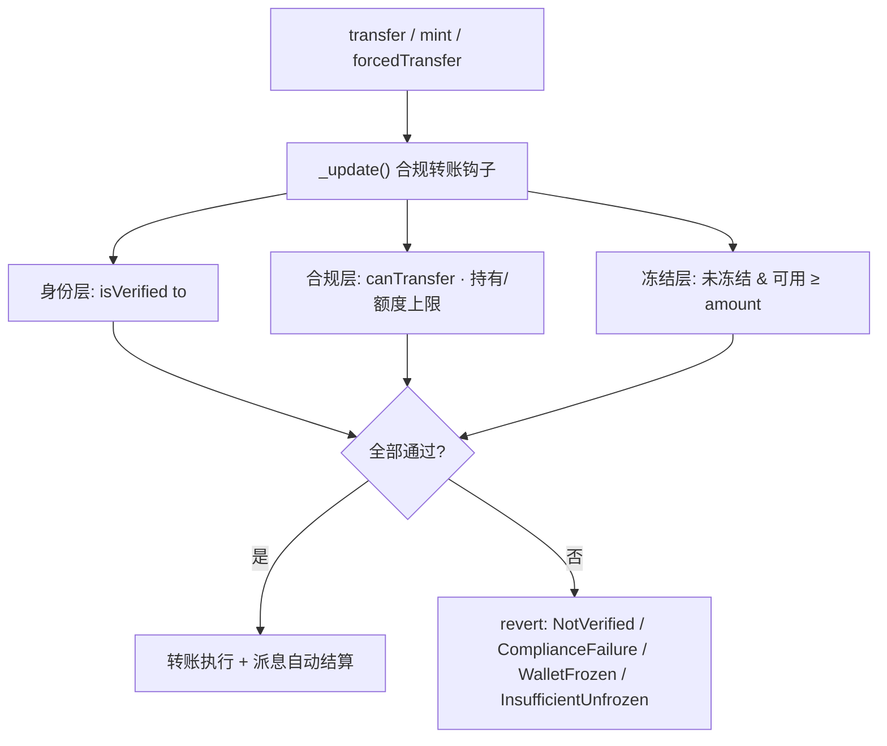

# Compliant RWA Issuance Agent · 项目概览

> Pharos Skill-to-Agent 提交物 · 浏览器版见 `SUBMISSION_DASHBOARD.html` · English pack: `../submission-build/pharos-rwa-skill-en/SUBMISSION_DASHBOARD.md`

## 项目摘要

面向 Pharos RealFi 的合规 RWA 发行 Skill。**已在 Atlantic 测试网完成部署与 smoke，并 spawn 出 `skills/MPF-asset/` 子 Skill**——不是概念，是已落地的可复用能力单元。

| 指标 | 数值 |
|---|---|
| Foundry 测试 | **24 passed**（含 fuzz） |
| 链上合约 | [`0xfef7…Aa3DE`](https://atlantic.pharosscan.xyz/address/0xfef7519bebda6c47af49583dbc9e60801f8aa3de) |
| 已 spawn 子 Skill | `skills/MPF-asset/` |
| Reference 文档 | 7 + SECURITY + QUICKSTART |
| 目标网络 | Atlantic Testnet · chainId 688689 |

## 生态飞轮（Skill 产 Skill）

```text
母 Skill（发行流水线）→ 部署 MPF @ Atlantic → spawn → skills/MPF-asset/
→ 任意 Agent 直接调用子 Skill 管理该资产，无需重新部署
```

每发行一支 RWA，生态就多一个**地址已固化、命令已写死**的可组合能力单元——Agent 越多、可复用资产 Skill 越多，合规 RWA 操作边际成本趋近于零。

## 端到端流水线

1. **链上尽调闸门** — 只读分析 + GREEN/YELLOW/RED 评级 + evidence；未通过拒绝发行
2. **合规 RWA 发行** — 部署、准入、受限转账、冻结/恢复、派息
3. **资产 Skill 输出** — 已生成 `skills/MPF-asset/`（合约 `0xfef7…Aa3DE` 已写死）

## 合约架构与合规闸门

单合约内聚 IdentityRegistry / ModularCompliance / 生命周期 / 派息四大模块，命名对齐 ERC-3643。每笔转移都经由 `_update()` 钩子的三层检查：



> `mint` 强制合规上限；`forcedTransfer` 为监管场景绕过合规层但仍要求收款方已验证。

## 核心能力

**合规与准入**：isVerified + canTransfer 双重检查 · 投资者注册 · 合规预检 · 规则治理

**资产生命周期**：mint / burn · 冻结与 pause · 钱包恢复 · 累计每股派息

**Pharos 集成**：SKILL.md 能力索引 · networks.json · cast/forge reference · Foundry 工程与自动化脚本

**Agent 安全**：私钥环境变量 · 高风险人工 confirm · receipt 断言 · state.json 审计留痕

## Skill 能力索引

| 用户场景 | Reference |
|---|---|
| 发行前链上尽调 | `onchain-diligence.md` |
| 合规发行与生命周期 | `rwa-issuance.md` |
| 收益派发 | `rwa-dividend.md` |
| 资产 Skill 生成 | `spawn-asset-skill.md` |
| Pharos 部署与验证 | `pharos-deploy-runbook.md` |
| 基础链上操作 | `pharos-base-ops.md` |

## 提交包内容

- `SKILL.md` — Agent 入口
- `references/` — 7 份操作指令
- `assets/rwa/CompliantRWAToken.sol` — 合约模板
- `src/` · `test/` · `script/` — Foundry 工程
- `scripts/` — 部署与验证自动化
- `VALIDATION_PLAN.md` — 可复现验证步骤
- `skills/MPF-asset/` — **已生成的资产专属 Skill（飞轮落点）**
- `SECURITY.md` · `QUICKSTART.md` · `WORKED_EXAMPLE.md` · `PHAROS_VISION.md`
- `COMPLETED_VALIDATION.md` — 本地 + 链上验证摘要

## 已完成验证（Atlantic Testnet · chainId 688689）

完整证据与可复现命令见 `COMPLETED_VALIDATION.md`：

| 验证项 | 结果 |
|---|---|
| Foundry 工具链 | forge / cast 1.7.1 |
| forge build | 编译成功 |
| forge test | 24 passed · 0 failed（含 fuzz 不变量） |
| Pharos Atlantic preflight | RPC 可连 · chainId 688689 · 钱包余额非 0 |
| **链上部署** | [`0xfef7…Aa3DE`](https://atlantic.pharosscan.xyz/address/0xfef7519bebda6c47af49583dbc9e60801f8aa3de) · deploy tx [`0x71eb…17e4d`](https://atlantic.pharosscan.xyz/tx/0x71ebe568c6d41390cfc6b6f452c30c85d38d0b4ddead941d19383a7e39417e4d) |
| **链上 smoke** | `mint(deployer, 1e18)` 成功 · `isVerified=true` · `holderCount=1` |
| **spawn 子 Skill** | `skills/MPF-asset/SKILL.md` 已生成 · `npm run spawn:asset` 可复现 |
| 私钥安全 | `.env` · `cache/` · `broadcast/` · `state.json` 均在 .gitignore |
