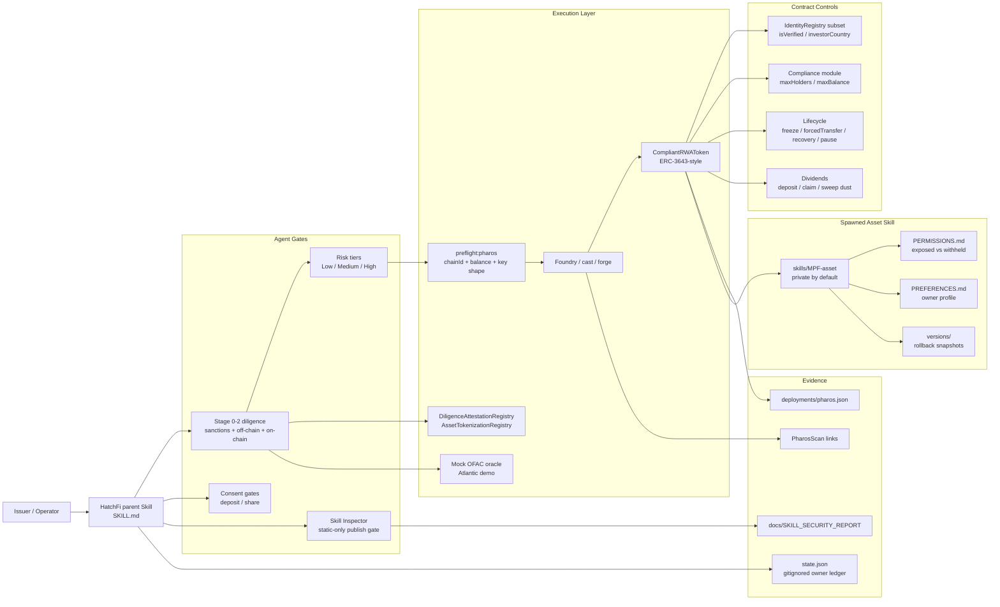

# HatchFi Architecture

HatchFi is a Pharos-native Skill-to-Agent package for compliant RWA issuance. It is organized as a layered agent system: diligence and safety gates first, contract execution second, private asset-skill spawning third, and pre-publish inspection before anything is shared.

## System Diagram



## Design Principles

| Principle | Implementation |
|---|---|
| Compliance first | RED diligence blocks issuance; `mint` and `transfer` both enforce identity + compliance caps |
| Agent safety | Write preflight, risk tiers, human confirmation for high-risk operations, receipt assertions |
| Data sovereignty | `state.json` and preference overlays are owner-private and gitignored |
| Permissioned ecosystem | Spawned Skills can be shared only by explicit opt-in with `PERMISSIONS.md` |
| Static publish gate | `scripts/skill_inspector.py` scans before install / upload / publish / share |
| Reproducibility | `refs:generate`, `eval:skill`, `inspect:skill`, `check` provide deterministic gates |
| On-chain audit trail | Optional `DiligenceAttestationRegistry` stores evidence hash (no PII); Phase 2 may gate `mint` |

## Trust Boundaries

1. **Public package**: `SKILL.md`, `references/`, `src/`, `scripts/`, generated contract surface, security reports.
2. **Owner-private state**: `state.json`, sensitive diligence evidence, investor data, preferences.
3. **Chain evidence**: PharosScan contract and transaction links, `deployments/pharos.json`.
4. **Shareable child Skill**: contract address and operation playbooks only; private data stays local.

## Verification Gates

```bash
npm run refs:check       # contract surface drift
npm run eval:skill       # 52 deterministic behavior checks
npm run inspect:skill    # static security gate
npm run check            # build + tests + package checks + inspector
```

Current release evidence:

- Foundry tests: 36 passed, 0 failed
- Skill eval: 64/64 passed
- Skill Inspector: 10/100 LOW, 0 critical/high/medium blockers
- Atlantic MPF: `0xfef7519bebda6c47af49583dbc9e60801f8aa3de`
- Mock OFAC oracle: `0x4FD317Ec868fdbd6e95c56f157DDf86d7b97F400`
