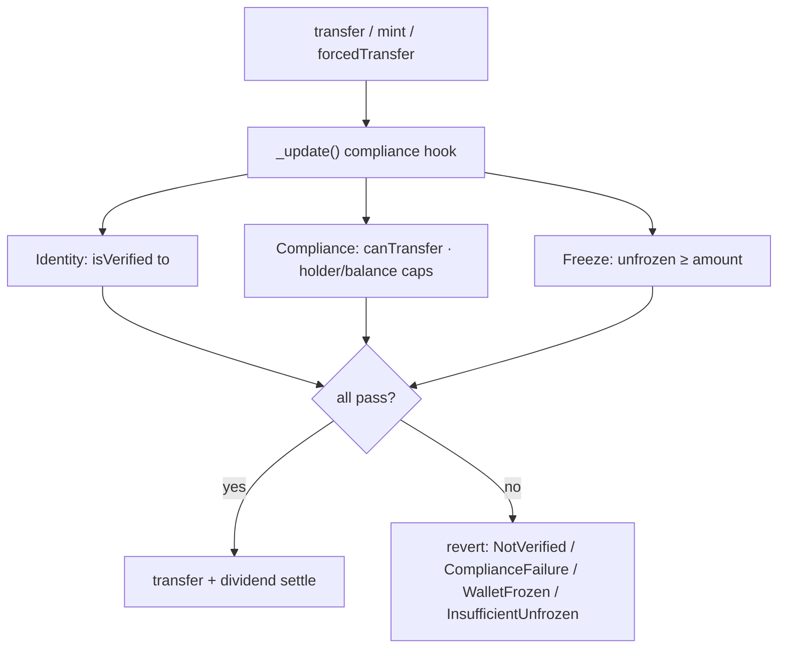

# Pharos Skill-to-Agent Submission Summary

> **Start here**
> - Browser: open `SUBMISSION_DASHBOARD.html`
> - Markdown: `docs/SUBMISSION.md`

## One-line pitch

**Compliant RWA Issuance Agent** is a Pharos-native skill that turns regulated real-world asset issuance into an agent-executable, auditable, reusable pipeline:

```text
Onchain diligence gate -> ERC-3643 compliant issuance -> Asset-specific skill spawning
```

## Why Pharos

Pharos focuses on RealFi, compliant value flows, and agentic infrastructure. This project maps directly to that stack: an agent can run pre-issuance onchain diligence, deploy an ERC-3643-style compliant RWA token, manage investor admission, restricted transfers, freeze/recovery, yield distribution, and spawn an asset-specific skill as a reusable capability unit.

## Core capabilities

- **Diligence gate**: read-only `cast` checks produce GREEN / YELLOW / RED ratings with evidence for every conclusion.
- **ERC-3643-style compliance**: every transfer must pass both `isVerified(to)` and `canTransfer(from, to, amount)`.
- **Lifecycle management**: identity registration, transfer pre-checks, freeze, forced transfer, wallet recovery, pause/unpause.
- **Dividend distribution**: cumulative per-share model avoids iterating holders — suitable for RWA yield.
- **Skill spawning**: after issuance, generate `skills/<SYMBOL>-asset/` with token address and asset parameters baked into references.
- **Staged verification**: independent gates for build, test, security, Pharos preflight, deploy, smoke, verify, and spawn.

## Composable network (Skill spawns Skill — live on Atlantic)

This is not a concept mock — **it has been run end-to-end on Atlantic testnet**:

```text
Compliant RWA Issuance Agent (parent skill)
  -> diligence gate -> deploy MPF -> smoke mint
  -> spawn skills/MPF-asset/ (child skill, contract address baked in)
  -> other agents can import MPF-asset without redeploying
```

| Layer | Package | Reuse |
|---|---|---|
| Parent skill | `SKILL.md` + 10 references | Any Pharos agent can drive the full RWA issuance pipeline |
| Child skill (generated) | `skills/MPF-asset/` | Operates **Manhattan Property Fund** at `0x9757…b5C3` |
| Contract | `CompliantRWAToken` @ Atlantic | 36 Foundry tests + on-chain smoke prove compliant mint/verification |

**Network effect**: each new RWA issued adds one composable capability unit; opt-in sharing can make compliant operations more reusable across agents on Pharos.

## Atlantic on-chain evidence (verified)

| Item | Value |
|---|---|
| Contract | [`0x975704ca2182b3fc64fd82ad2c01d8ec5be0b5c3`](https://atlantic.pharosscan.xyz/address/0x975704ca2182b3fc64fd82ad2c01d8ec5be0b5c3) |
| Deploy tx | [`0xd00bcc…a023`](https://atlantic.pharosscan.xyz/tx/0xd00bcc18e78f85eaa9f62ee907a6adac13c9a45f6f7266699e57487beb61a023) |
| Smoke mint tx | `0x1b2127…bb5541` · deployer `isVerified=true` · `balanceOf=1e18` · `holderCount=1` |
| Network | Pharos Atlantic **Testnet** |
| Smoke note | `registerIdentity` skipped when deployer already verified; mint + receipt assert is the executed path |
| Spawned child skill | `skills/MPF-asset/SKILL.md` (one command: `npm run spawn:asset`) |

> Machine-readable records: `deployments/pharos.json` · `DEPLOYMENT_RESULT.md` · `docs/COMPLETED_VALIDATION.md`

### Evidence slots for future assets / final-demo refresh

| Slot | Current value | Update rule |
|---|---|---|
| RWA contract | `0x975704ca2182b3fc64fd82ad2c01d8ec5be0b5c3` | Replace after `npm run deploy:pharos` writes `deployments/pharos.json` |
| Deploy receipt | `0xd00bcc18e78f85eaa9f62ee907a6adac13c9a45f6f7266699e57487beb61a023` | Must link to PharosScan and show `status == 1` |
| Smoke receipt | `0x1b212771313c0ad0b382f99c69c027bdd5265e0cc64b619792adbd9038063905` | Must prove at least one compliant mint / holder state |
| Sanctions oracle | `0x4FD317Ec868fdbd6e95c56f157DDf86d7b97F400` | Replace if a fresh Mock OFAC oracle is deployed |
| Spawned Skill | `skills/MPF-asset/` | Replace with `skills/<SYMBOL>-asset/` after `npm run spawn:asset` |
| Security report | `docs/SKILL_SECURITY_REPORT.md` | Regenerate with `npm run inspect:skill:md` before sharing |

## Contract architecture and compliance gate

The contract co-locates IdentityRegistry / ModularCompliance / lifecycle / dividends in one deployable unit. Function and event names align with ERC-3643 for future multi-contract split. Every transfer passes three checks in `_update()`:



> `mint` and `forcedTransfer` are regulatory paths: `mint` enforces the same caps; `forcedTransfer` bypasses global rules but still requires a verified recipient.

## Key files

| File | Role |
|---|---|
| `SKILL.md` | Agent entry and capability index |
| `SUBMISSION_DASHBOARD.html` | **Project overview** (pipeline + capabilities + submission package) |
| `references/onchain-diligence.md` | On-chain diligence (#2–#10) |
| `references/offchain-diligence.md` | Off-chain background (#12–#15) |
| `references/sanctions-screening.md` | Sanctions layer (#1/#11) |
| `references/compliance-knowledge.md` | ERC-3643 mapping + red flags |
| `references/rwa-issuance.md` | Compliant issuance and lifecycle ops |
| `references/rwa-dividend.md` | Yield distribution reference |
| `references/spawn-asset-skill.md` | Spawn / refine / version design |
| `references/pharos-base-ops.md` | Pharos Skill Engine-aligned cast/forge |
| `references/pharos-deploy-runbook.md` | Pharos deploy runbook |
| `references/pharos-verification.md` | Staged quality verification loop |
| `assets/networks.json` | Atlantic / Pacific network config |
| `src/CompliantRWAToken.sol` | ERC-3643-style RWA token |
| `test/CompliantRWAToken.t.sol` | Foundry tests (incl. fuzz) |
| `scripts/` | preflight, deploy result, smoke, verify, spawn automation |
| `skills/MPF-asset/` | **Generated asset skill** (contract address baked in) |
| `docs/SECURITY.md` | Contract security audit and permission matrix |
| `docs/QUICKSTART.md` | 5-minute path: build → test → deploy → spawn |

## Demo scenarios

1. Run onchain diligence on issuer/custodian addresses with evidence-backed ratings.
2. Show RED-rated addresses are blocked by the issuance gate.
3. Deploy a compliant RWA token, register investors, and mint shares.
4. Demonstrate restricted transfer semantics: unverified addresses cannot receive tokens.
5. Deposit and query dividends.
6. Spawn an asset-specific skill to turn a new issuance into a reusable capability unit.

## Completed verification

```bash
cd pharos-rwa-skill
npm run build && npm run test
export PRIVATE_KEY=0x...   # local terminal only
export PHAROS_RPC_URL=https://atlantic.dplabs-internal.com
npm run preflight:pharos && npm run deploy:pharos && npm run smoke:pharos && npm run spawn:asset
```

**Local**: Foundry 1.7.1 · `forge build` OK · all tests green (incl. fuzz invariant) · preflight OK.

**On-chain**: MPF deployed on Atlantic **Testnet** · smoke mint 1e18 succeeded · `skills/MPF-asset/` spawned.

See `docs/COMPLETED_VALIDATION.md`. Private keys are read from environment variables only — never written to source, docs, or git.
