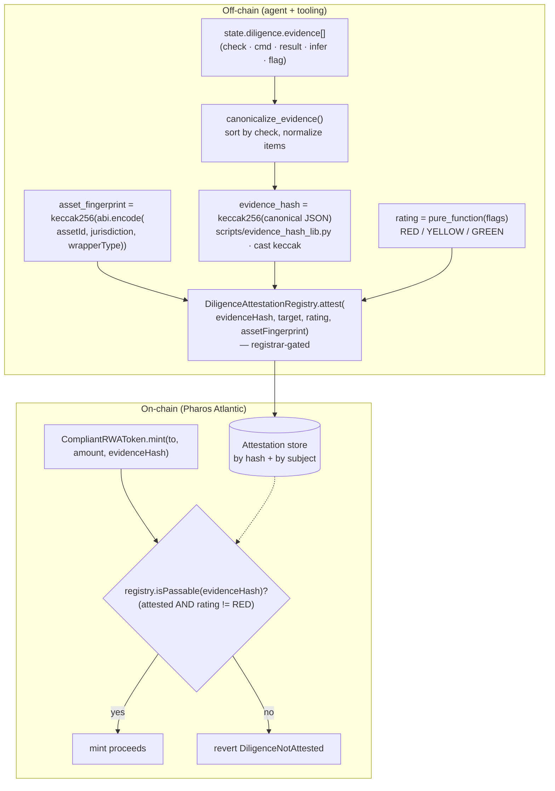

# Diligence Attestation Protocol

How a diligence conclusion becomes an **on-chain, PII-free, mint-enforcing** fact.

The chain never sees investor identities or evidence contents — only a `keccak256`
commitment. The same bytes are produced by the Python tooling (`cast keccak`) and by
Solidity (golden test `test_EvidenceHashGoldenFixture`), so a judge can independently
recompute every hash.

## Pipeline



## Guarantees

1. **Fail-closed, recipient-bound mint.** `mint` reverts `DiligenceAttestationRegistryNotSet`
   if no registry is wired, and `DiligenceNotAttested(evidenceHash)` unless
   `isPassableFor(evidenceHash, to)` returns true — i.e. the attestation exists, is **not
   revoked**, is **within its validity window**, passed the gate (not RED), **and is bound to the
   recipient** `to`. So a hash cleared for one address cannot mint to another, a stale hash
   expires, and a re-screen can `revoke` it. (The live Atlantic deployment predates this
   hardening — see "Known limitations" in `docs/SECURITY.md`; the fix ships in `src/` with tests
   and takes effect on redeploy.)
2. **No PII on chain.** Only `evidenceHash` and `assetFingerprint` (both `bytes32`) are stored.
   The evidence itself stays in the issuer's private `state.json`.
3. **Cross-language reproducibility.** `evidence_hash()` (Python, via `cast keccak`) equals the
   Solidity `keccak256` of the same canonical bytes — pinned by `eval/evidence_hash_golden.json`
   and the Foundry golden tests.

## Function reference

| Layer | Symbol | Purpose |
|---|---|---|
| Tooling | `canonicalize_evidence(evidence)` | Deterministic ordering + item normalization |
| Tooling | `evidence_hash(evidence)` | `keccak256` of the canonical JSON |
| Tooling | `asset_fingerprint(id, jur, wrapper)` | `keccak256(abi.encode(...))` |
| Registry | `attest(evidenceHash, target, rating, assetFingerprint)` | Registrar records a conclusion |
| Registry | `isPassable(evidenceHash)` | live (non-revoked, non-expired) AND `rating != RED` |
| Registry | `isPassableFor(evidenceHash, target)` | `isPassable` AND bound to `target` — the mint gate |
| Registry | `revoke(evidenceHash)` / `validityWindow` | registrar revocation · time-boxed validity |
| Registry | `isGreen` / `attestationByHash` / `latestAttestation` | Read-only lookups |
| Token | `mint(to, amount, evidenceHash)` | Reverts unless `isPassableFor(evidenceHash, to)` |

## Reproduce (no wallet)

```bash
npm run evidence:hash        # canonical evidence → keccak256
npm run evidence:fingerprint # asset fingerprint for MPF
npm run attest:dry-run       # gate + calldata, no PRIVATE_KEY
npm run eval:skill           # golden hash vectors verified in-suite
```

Related: [`references/onchain-attestation.md`](../references/onchain-attestation.md) ·
[`src/DiligenceAttestationRegistry.sol`](../src/DiligenceAttestationRegistry.sol) ·
[`eval/evidence_hash_golden.json`](../eval/evidence_hash_golden.json)
